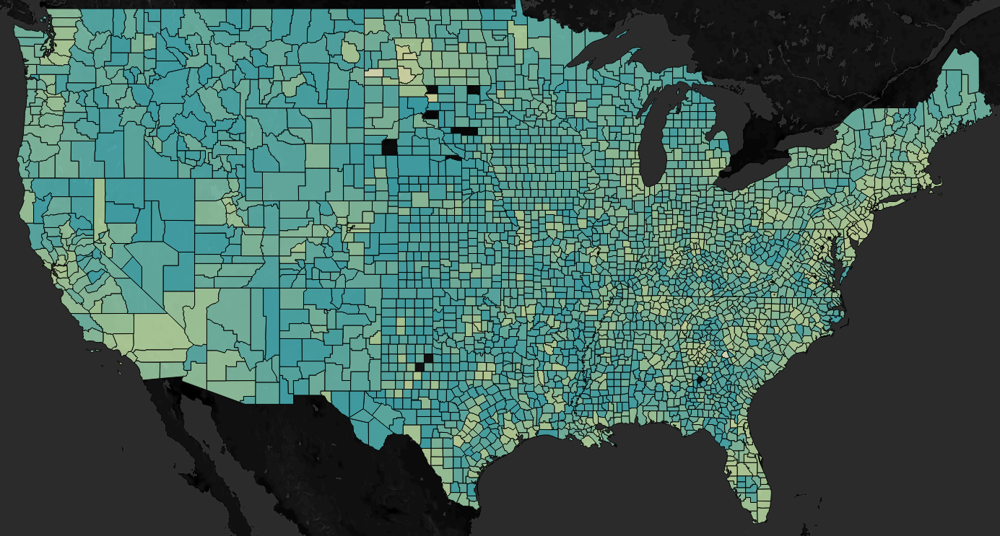

# Capstone 2: Internet Accessibility Demographic Analysis

## Scope

This analysis was designed using Python, Alteryx, and Tableau.  It focuses on how Internet accebility in communities accross the United States may be affected by income inequality and how far these communities may be from metropolitan areas.

The datasets used for this analysis come from [Ookla](https://www.speedtest.net/insights/blog/announcing-ookla-open-datasets/), [United States Department of Agriculture's Economic Research Service](https://www.ers.usda.gov/data-products/county-level-data-sets/), [Census Bureau](https://www.census.gov/programs-surveys/popest/data/data-sets.html), and the [Bureau of Economic Analysis](https://www.bea.gov/data/gdp/gdp-county-metro-and-other-areas).

## Analysis 

Internet Access is essential for the technology advancement and economic development of our communities. Through this analysis, we can see that there may be a statistical correlation between Internet's quality, income inequality, and whether a county's landcape is either rural or has small urban towns. 

### Repository and Public Tableau URL's

GitHub Title: Internet SpeedTest Demographic Analysis [https://github.com/ivanzapatarivera/Internet_SpeedTest_Demographic_Analysis](https://github.com/ivanzapatarivera/Internet_SpeedTest_Demographic_Analysis)

Public Tableau URL [https://tabsoft.co/3h4BWv6](https://tabsoft.co/3h4BWv6)

### Screenshot

